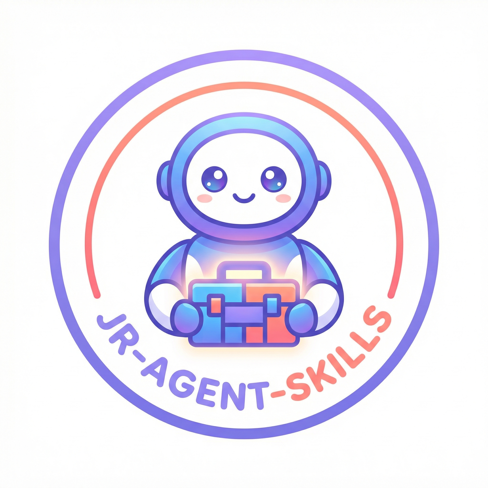

<p align="center">
  
</p>

<h1 align="center">JR-OpenClaw-Skills</h1>

<p align="center">
  <b>为 OpenClaw 精心打造的模块化 AI Agent 技能集合</b>
</p>

<p align="center">
  <a href="./LICENSE">
    
  </a>
  
  
</p>

<p align="center">
  <a href="./README.md">English</a> •
  <a href="#-技能目录">技能目录</a> •
  <a href="#-快速开始">快速开始</a> •
  <a href="#-贡献指南">贡献指南</a>
</p>

---

## 📖 项目简介

**JR-OpenClaw-Skills** 是一套专为 [OpenClaw](https://github.com/openclaw/openclaw) AI Agent 设计的即用型技能模块集合。每个技能都是独立的功能单元，可以无缝集成到您的 Agent 工作流中。

无论您需要网页自动化、媒体生成、文档处理还是多智能体协作 —— 这里都有您需要的工具。

## ✨ 核心特性

- 🎯 **模块化设计** — 每个技能独立封装，即插即用
- 📚 **文档完善** — 每个技能都包含详细的 README 和使用示例
- 🚀 **生产就绪** — 经过实战检验的技能，可直接用于生产环境
- 🔄 **持续维护** — 定期更新并持续添加新技能
- 🌐 **多语言支持** — 同时提供中英文文档

## 📦 技能目录

### 🌐 网页自动化
| 技能 | 功能描述 | 路径 |
|:------|:---------|:-----|
| **agent-browser** | 浏览器自动化，支持网页导航、截图、表单填写和数据提取 | [`agent-browser/`](./agent-browser/) |

### 🎙️ 语音与音频
| 技能 | 功能描述 | 路径 |
|:------|:---------|:-----|
| **doubao-open-tts** | 基于豆包（火山引擎）API 的文本转语音服务，支持 200+ 种音色 | [`doubao-open-tts/`](./doubao-open-tts/) |

### 🎨 图像生成
| 技能 | 功能描述 | 路径 |
|:------|:---------|:-----|
| **nano-banana-pro** | 使用 Google Nano Banana Pro (Gemini) API 进行 AI 图像生成 | [`nano-banana-pro/`](./nano-banana-pro/) |
| **volcengine-image-gen** | 使用火山引擎（Seedream）模型生成高质量图像 | [`volcengine-image-gen/`](./volcengine-image-gen/) |
| **google-images-crawler** | 从 Google 图片搜索爬取高分辨率原图 | [`google-images-crawler/`](./google-images-crawler/) |
| **excalidraw-flowchart** | 从描述创建 Excalidraw 流程图，支持 DSL 和 DOT 格式 | [`excalidraw-flowchart/`](./excalidraw-flowchart/) |

### 🎬 视频创作
| 技能 | 功能描述 | 路径 |
|:------|:---------|:-----|
| **hf-papers-to-video** | 将 Hugging Face Daily Papers 转换为带 AI 配音的专业视频摘要 | [`hf-papers-to-video/`](./hf-papers-to-video/) |
| **remotion-synced-video** | 使用 Remotion、TTS 和 Unsplash 图片创建同步视频 | [`remotion-synced-video/`](./remotion-synced-video/) |
| **search-video-on-web-and-gen** | 在网页上搜索视频素材并生成专业视频 | [`search-video-on-web-and-gen/`](./search-video-on-web-and-gen/) |
| **remotion** | Remotion 在 React 中创建视频的最佳实践和工具 | [`remotion/`](./remotion/) |
| **video-transcript-downloader** | 从 YouTube 和其他网站下载视频、音频、字幕和转录文本 | [`video-transcript-downloader/`](./video-transcript-downloader/) |

### 📄 文档与研究
| 技能 | 功能描述 | 路径 |
|:------|:---------|:-----|
| **hf-papers-reporter** | 从 Hugging Face Daily Papers 生成包含摘要和图表的 Word 报告 | [`hf-papers-reporter/`](./hf-papers-reporter/) |
| **paper-daily** | 每日论文追踪和管理工具 | [`paper-daily/`](./paper-daily/) |
| **tech-analysis-reporter** | 通过多轮对话生成专业技术分析报告 | [`tech-analysis-reporter/`](./tech-analysis-reporter/) |
| **report-generator** | 通用报告生成工具 | [`report-generator/`](./report-generator/) |

### 🤖 Agent 工具
| 技能 | 功能描述 | 路径 |
|:------|:---------|:-----|
| **multi-agent-team** | 多智能体团队协作，支持动态角色（3 个执行者 + 1 个 QA） | [`multi-agent-team/`](./multi-agent-team/) |
| **long-term-task** | 长期任务管理，支持多轮对话和双心跳监控 | [`long-term-task/`](./long-term-task/) |
| **session-cleaner** | 清理和管理 OpenClaw 会话，关闭子 Agent 并重置上下文 | [`session-cleaner/`](./session-cleaner/) |
| **auto-updater** | 自动每日更新 Clawdbot 和已安装技能，附带变更摘要 | [`auto-updater/`](./auto-updater/) |

### 🔧 开发工具
| 技能 | 功能描述 | 路径 |
|:------|:---------|:-----|
| **github-commit-push** | 完整的 Git 提交和推送工作流，支持远程配置和冲突处理 | [`github-commit-push/`](./github-commit-push/) |

## 🚀 快速开始

### 环境要求

- 已安装并配置 [OpenClaw](https://github.com/openclaw/openclaw)
- 特定技能所需的 API 密钥（详见各技能 README）

### 安装步骤

1. 克隆本仓库：
```bash
git clone https://github.com/xdrshjr/JR-OpenClaw-Skills.git
cd JR-OpenClaw-Skills
```

2. 进入任意技能目录：
```bash
cd doubao-open-tts
```

3. 按照该技能的 README 进行设置和使用。

### 使用示例

```bash
# 示例：使用 doubao-open-tts 技能
cd doubao-open-tts
python3 scripts/tts.py "你好，世界！" -v zh_female_cancan_mars_bigtts -o output.mp3
```

## 📁 项目结构

```
JR-OpenClaw-Skills/
├── 📄 README.md                    # 英文版文档
├── 📄 README_CN.md                 # 本文件（中文版）
├── 🖼️  logo.png                    # 项目 Logo
│
├── 🌐 agent-browser/               # 浏览器自动化
├── 🔄 auto-updater/                # 自动更新工具
├── 🎙️  doubao-open-tts/             # 豆包 TTS
├── 📊 excalidraw-flowchart/        # 流程图创建
├── 🔧 github-commit-push/          # Git 工作流
├── 🖼️  google-images-crawler/       # 图片爬取
├── 📄 hf-papers-reporter/          # HF 论文转 Word
├── 🎬 hf-papers-to-video/          # HF 论文转视频
├── 📋 long-term-task/              # 长期任务管理
├── 👥 multi-agent-team/            # 多智能体团队协调
├── 🎨 nano-banana-pro/             # Gemini 图像生成
├── 📰 paper-daily/                 # 论文追踪
├── 🎬 remotion/                    # Remotion 工具
├── 🎥 remotion-synced-video/       # 同步视频创建
├── 📊 report-generator/            # 报告生成
├── 🔍 search-video-on-web-and-gen/ # 视频搜索与生成
├── 🧹 session-cleaner/             # 会话清理
├── 📈 tech-analysis-reporter/      # 技术分析报告
├── 📥 video-transcript-downloader/ # 视频下载
└── 🎨 volcengine-image-gen/        # 火山引擎图像生成
```

## 🤝 贡献指南

我们欢迎各种形式的贡献！请参阅我们的 [贡献指南](#) 了解详情。

### 贡献规范

- 🔹 每个技能应放在独立的目录中
- 📖 包含全面的 README 文档
- 💡 提供清晰的使用示例
- 🔄 添加新技能时同时更新 `README.md` 和 `README_CN.md`

## 👨‍💻 开发者

**xdrshjr**

[](https://github.com/xdrshjr)

## 📄 开源协议

本项目基于 **MIT 协议** 开源 — 详见 [LICENSE](./LICENSE) 文件。

---

<p align="center">
  用 ❤️ 为 OpenClaw 社区打造
</p>

<p align="center">
  <a href="./README.md">English</a> | <a href="./README_CN.md">中文</a>
</p>
