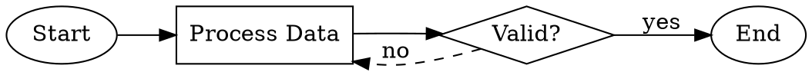

# Excalidraw Flowchart Skill

Create professional flowcharts and diagrams as Excalidraw files that can be opened in Excalidraw.

## When to Use This Skill

- User asks to create a flowchart or diagram
- User wants to visualize a process or workflow
- User needs an architecture diagram
- User mentions "excalidraw" or "flow diagram"
- User wants to document decision trees

## Prerequisites

The `@swiftlysingh/excalidraw-cli` tool must be installed:

```bash
npm install -g @swiftlysingh/excalidraw-cli
```

Or use via npx (no installation needed):

```bash
npx @swiftlysingh/excalidraw-cli create --inline "DSL" -o output.excalidraw
```

## How to Create a Flowchart

### Step 1: Analyze the Request

Identify from the user's description:
- What are the main steps/nodes?
- What are the decision points?
- What is the flow direction?
- Are there any loops or branches?

### Step 2: Write the DSL

Use this DSL syntax to describe the flowchart:

| Syntax | Element | Use For |
|--------|---------|---------|
| `[Label]` | Rectangle | Process steps, actions |
| `{Label?}` | Diamond | Decisions, conditionals |
| `(Label)` | Ellipse | Start/End points |
| `[[Label]]` | Database | Data storage |
| `![path]` | Image | Inline images |
| `` | Sized Image | Images with explicit dimensions |
| `->` | Arrow | Connections |
| `-> "text" ->` | Labeled Arrow | Connections with labels |
| `-->` | Dashed Arrow | Optional/alternative paths |

### DSL Directives

| Directive | Description | Example |
|-----------|-------------|---------|
| `@direction` | Set flow direction | `@direction LR` |
| `@spacing` | Set node spacing | `@spacing 60` |
| `@image` | Position image | `@image logo.png at 100,50` |
| `@decorate` | Attach decoration to node | `@decorate icon.png top-right` |
| `@sticker` | Add sticker from library | `@sticker checkmark at 200,100` |
| `@library` | Set sticker library path | `@library ./assets/stickers` |
| `@scatter` | Scatter images on canvas | `@scatter star.png count:5` |

### Step 3: Generate the File

Run the CLI to create the .excalidraw file:

```bash
npx @swiftlysingh/excalidraw-cli create --inline "YOUR_DSL_HERE" -o flowchart.excalidraw
```

Or for multi-line DSL, use a heredoc:

```bash
npx @swiftlysingh/excalidraw-cli create --inline "$(cat <<'EOF'
(Start) -> [Step 1] -> {Decision?}
{Decision?} -> "yes" -> [Step 2] -> (End)
{Decision?} -> "no" -> [Step 3] -> [Step 1]
EOF
)" -o flowchart.excalidraw
```

### Step 4: Inform the User

Tell the user:
1. The file was created at the specified path
2. They can open it in Excalidraw (https://excalidraw.com) via File > Open
3. They can edit it further in Excalidraw if needed

## DSL Examples

### Simple Linear Flow

```
(Start) -> [Initialize] -> [Process Data] -> [Save Results] -> (End)
```

### Decision Tree

```
(Start) -> [Receive Request] -> {Authenticated?}
{Authenticated?} -> "yes" -> [Process Request] -> (Success)
{Authenticated?} -> "no" -> [Return 401] -> (End)
```

### Loop/Retry Pattern

```
(Start) -> [Attempt Operation] -> {Success?}
{Success?} -> "yes" -> [Continue] -> (End)
{Success?} -> "no" -> {Retry Count < 3?}
{Retry Count < 3?} -> "yes" -> [Increment Counter] -> [Attempt Operation]
{Retry Count < 3?} -> "no" -> [Log Failure] -> (Error)
```

### Multi-Branch Flow

```
(User Input) -> {Input Type?}
{Input Type?} -> "text" -> [Parse Text] -> [Process]
{Input Type?} -> "file" -> [Read File] -> [Process]
{Input Type?} -> "url" -> [Fetch URL] -> [Process]
[Process] -> [Output Result] -> (Done)
```

### With Database

```
[API Request] -> {Cache Hit?}
{Cache Hit?} -> "yes" -> [[Read Cache]] -> [Return Data]
{Cache Hit?} -> "no" -> [[Query Database]] -> [[Update Cache]] -> [Return Data]
```

## CLI Options

- `-o, --output <file>` - Output file path (default: flowchart.excalidraw)
- `-f, --format <type>` - Input format: dsl, json, dot (default: auto-detected)
- `-d, --direction <TB|BT|LR|RL>` - Flow direction (default: TB = top to bottom)
- `-s, --spacing <number>` - Node spacing in pixels (default: 50)
- `--inline <dsl>` - Inline DSL/DOT string
- `--stdin` - Read input from stdin
- `--verbose` - Verbose output

Example with options:

```bash
npx @swiftlysingh/excalidraw-cli create --inline "[A] -> [B] -> [C]" --direction LR --spacing 80 -o horizontal-flow.excalidraw
```

## DOT/Graphviz Format (New in v1.1.0)

The CLI now supports DOT/Graphviz format for creating diagrams. This is useful when working with existing DOT files or when you prefer the DOT syntax.

### DOT Syntax



### Supported DOT Features

| Feature | DOT Syntax | Maps To |
|---------|-----------|---------|
| Rectangle | `shape=box` or `shape=rect` | `[Label]` |
| Diamond | `shape=diamond` | `{Label}` |
| Ellipse | `shape=ellipse` or `shape=circle` | `(Label)` |
| Database | `shape=cylinder` | `[[Label]]` |
| Direction | `rankdir=TB\|BT\|LR\|RL` | `@direction` |
| Edge labels | `[label="text"]` | `-> "text" ->` |
| Dashed edges | `[style=dashed]` | `-->` |
| Colors | `[fillcolor="..." color="..."]` | Node styling |

### Using DOT Files

```bash
# From file (auto-detected by .dot or .gv extension)
npx @swiftlysingh/excalidraw-cli create diagram.dot -o output.excalidraw

# Inline DOT
npx @swiftlysingh/excalidraw-cli create --format dot --inline "digraph { A -> B -> C }" -o output.excalidraw
```

## Images and Decorations (New in v1.1.0)

### Image Nodes

Include images as flow elements:

```
(Start) ->  -> [Process] -> (End)
```

### Positioned Images

Place images at specific positions:

```
@image background.png at 0,0
@image logo.png near (Start) top-right

(Start) -> [Process] -> (End)
```

### Node Decorations

Attach small icons/badges to nodes:

```
[Deploy to Production]
@decorate checkmark.png top-right

[Review Required]
@decorate warning.png top-left
```

Decoration anchors: `top`, `bottom`, `left`, `right`, `top-left`, `top-right`, `bottom-left`, `bottom-right`

### Sticker Library

Use a library of reusable stickers:

```
@library ./assets/stickers
@sticker success at 100,100
@sticker warning near (Error) top-right
```

### Scatter Images

Distribute images randomly across the canvas:

```
@scatter confetti.png count:10
@scatter star.png count:5 width:20 height:20
```

## Common Patterns

### API Request Flow

```
[Client Request] -> [API Gateway] -> {Auth Valid?}
{Auth Valid?} -> "yes" -> [Route to Service] -> [[Database]] -> [Response]
{Auth Valid?} -> "no" -> [401 Unauthorized]
```

### CI/CD Pipeline

```
(Push) -> [Build] -> [Test] -> {Tests Pass?}
{Tests Pass?} -> "yes" -> [Deploy Staging] -> {Manual Approval?}
{Manual Approval?} -> "yes" -> [Deploy Production] -> (Done)
{Manual Approval?} -> "no" -> (Cancelled)
{Tests Pass?} -> "no" -> [Notify Team] -> (Failed)
```

### User Registration

```
(Start) -> [Enter Details] -> {Email Valid?}
{Email Valid?} -> "no" -> [Show Error] -> [Enter Details]
{Email Valid?} -> "yes" -> {Password Strong?}
{Password Strong?} -> "no" -> [Show Password Requirements] -> [Enter Details]
{Password Strong?} -> "yes" -> [[Save to Database]] -> [Send Verification Email] -> (Success)
```

## Tips

1. **Keep labels concise** - Use short, action-oriented text
2. **End decisions with ?** - Makes it clear it's a conditional
3. **Use consistent naming** - Helps with node deduplication
4. **Start with (Start)** - Makes the entry point clear
5. **Test complex flows** - Break into smaller parts if needed
